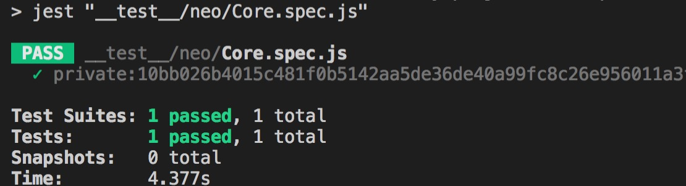

# neo 区块链钱包账号

## 钱包账号
neo钱包主要包括一下部分：`address`,`privateKey`,`publicKey`,`scriptHash`,`WIF`这几个部分；它们之间存在一定的转化关系：
> NEP<=>WIF <=> Private => Public => ScriptHash <=> Address

**不开玩笑，除了 `address` 可以告诉别人以外，其它的对谁都不要说，`address`类似一个银行卡号，是别人想给你转账的时候使用的**

## 创建钱包账号
```javascript
import { wallet } from '@cityofzion/neon-js';

/**
 * 根据passpase生产一个新的neo账号
 * @param {*} passphase 
 * @param {*} confirmPassphase 
 * @param {*} wif 
 */
export function createWalletAccount(passphase: string, confirmPassphase: string, wif?: string): ?WalletAccount {

  if (passphase !== confirmPassphase) return null;

  var account = new wallet.Account(wif || wallet.generatePrivateKey());
  const encryptedWIF = wallet.encrypt(account.WIF, passphase);

  const result: WalletAccount = {
    address: account.address,
    privateKey: account.privateKey,
    publicKey: account.publicKey,
    scriptHash: account.scriptHash,
    WIF: account.WIF,
    encryptedWIF,
    passphase,
  }

  return result;
}
```

## 创建钱包账号单元测试
通过`jest`对创建钱包的方法进行单元测试

```javascript
test('createWalletAccount ', () => {
  const passphase = '123456';
  const account = createWalletAccount(passphase, passphase);
  console.log(account);
  expect(account.address !== null).toBe(true);
});
```

运行结果如下所示，就是当前生成的账号信息，可以使用`neo-wallet`登录一下试试。
```javascript
{ 
  address: 'AUMgtJsw3kBrcA7poBYNaonZTGMNoqZNLy',
  privateKey: '10bb026b4015c481f0b5142aa5de36de40a99fc8c26e956011a3f820f7708fba',
  publicKey: '03af2ad8725c4926632d6816f5502d8f749dec369afadfe0bb5ac697fe22a0ef77',
  scriptHash: 'a8f677c132f2c82d73ff138e817e784c25ab068a',
  WIF: 'KwnETPM2m8wTAY3qySvDVLf3Vpfg77nvJhxR2Qyi8uMWKoqP1Q3f',
  encryptedWIF: '6PYVHykkA1TfyQ2344wftv5e7vRoecV4iVwEVZ62aqCAx3dh3LDrRV19AS',
  passphase: '123456' 
}
```


# 转化
正如前面所述的，钱包里的各个数据存在一定的转化关系，至于详细的相互之间转化的原理，先不至讨论，我们可以使用`neon-js`的相关API来查看是否正确转化。

> NEP<=>WIF <=> Private => Public => ScriptHash <=> Address

下面先新建一个`jtest`的单元测试文件`Core.spec.js`

## 私钥到公钥的转化

这里使用上面生成的测试账号进行测试，注意因为是测试账号以后我不会再使用，所以暴露出来，如果是你的个人账号，请一定不要暴露`WIF`以及`privateKey`。

单元测试代码如下：

```javascript
import {wallet} from '@cityofzion/neon-js';

test('private:10bb026b4015c481f0b5142aa5de36de40a99fc8c26e956011a3f820f7708fba get PUb_Key',()=>{
  const pubKey = wallet.getPublicKeyFromPrivateKey('10bb026b4015c481f0b5142aa5de36de40a99fc8c26e956011a3f820f7708fba');
  expect(pubKey).toBe('03af2ad8725c4926632d6816f5502d8f749dec369afadfe0bb5ac697fe22a0ef77');
});
```

使用命令运行单元测试：

```bash
npm run test __test__/neo/Core.spec.js
```

运行结果：

<p style="text-align:center"></p>

## 所有转化
完整的转化关系如下：

```javascript
import {wallet} from '@cityofzion/neon-js';

const walletAccount = { 
  address: 'AUMgtJsw3kBrcA7poBYNaonZTGMNoqZNLy',
  privateKey: '10bb026b4015c481f0b5142aa5de36de40a99fc8c26e956011a3f820f7708fba',
  publicKey: '03af2ad8725c4926632d6816f5502d8f749dec369afadfe0bb5ac697fe22a0ef77',
  scriptHash: 'a8f677c132f2c82d73ff138e817e784c25ab068a',
  WIF: 'KwnETPM2m8wTAY3qySvDVLf3Vpfg77nvJhxR2Qyi8uMWKoqP1Q3f',
  encryptedWIF: '6PYVHykkA1TfyQ2344wftv5e7vRoecV4iVwEVZ62aqCAx3dh3LDrRV19AS',
  passphase: '123456' 
};

// WIF <=> privateKey
test('WIF <=> privateKey',()=>{
  const wif = wallet.getWIFFromPrivateKey(walletAccount.privateKey);
  expect(wif).toBe(walletAccount.WIF);
  const privateKey = wallet.getPrivateKeyFromWIF(walletAccount.WIF);
  expect(privateKey).toBe(walletAccount.privateKey);
});

// privateKey => publicKey
test(`privateKey => publicKey:${walletAccount.privateKey}`,()=>{
  const pubKey = wallet.getPublicKeyFromPrivateKey(walletAccount.privateKey);
  expect(pubKey).toBe(walletAccount.publicKey);
});

// publicKey => ScriptHash
test(`publicKey => ScriptHash:${walletAccount.publicKey}`,()=>{
  const scriptHash = wallet.getScriptHashFromPublicKey(walletAccount.publicKey);
  expect(scriptHash).toBe(walletAccount.scriptHash);
});

// scriptHash <=> address
test('scriptHash <=> address',()=>{
  const address = wallet.getAddressFromScriptHash(walletAccount.scriptHash);
  expect(address).toBe(walletAccount.address);
  const scriptHash = wallet.getScriptHashFromAddress(walletAccount.address);
  expect(scriptHash).toBe(walletAccount.scriptHash);
});

```

# 总结

如上，主要说明了`neo`账号的创建，以及讲述账号各个字段之间的转化关系，本篇使用的api为`neon-js`，这是`coz`在`github`社区开源的`neo`钱包api，它包含了钱包开发的所有的api，我认为它是学习钱包的很好的材料，当然`neo-gui`，`neo-cli`本身也是开源的，完全可以使用它们的源码来学习，只是相较于`C#`，对于开发跨平台应用，我更喜欢基于`electron`的方案。

为了学习开发`neo`钱包，我搭建了一个`electron`的`boilerplate`，作为快速启动的基础，这样其他同样想用此方案的朋友就不用再一次去搭建环境了。此`boilerplate`具体集成了以下技术方案：`electron`，`React`，`dva`，`flow`，`antd`；后面会抽时间把文中提到的`jest`也集成进去以便可以开箱即用的写单元测试。

[boilerplate传送门](https://github.com/Cody1988/webpack-electron-react-dev-antd-flow-bolierplate)